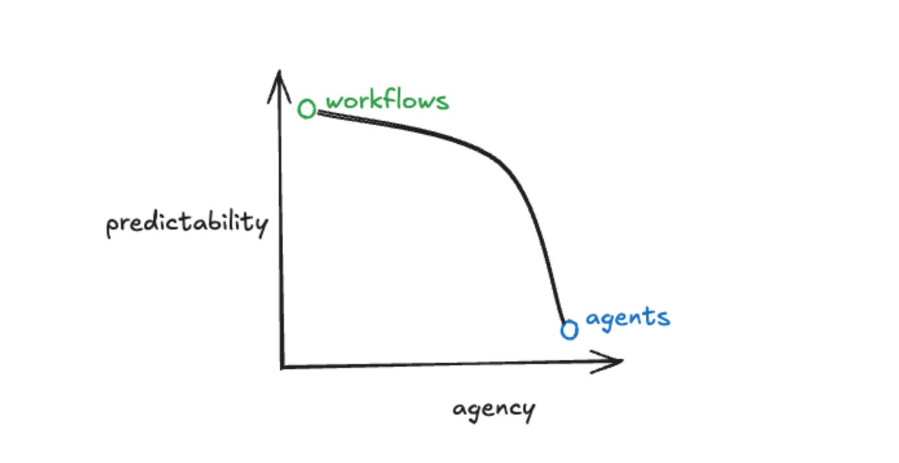

<!-- Mermaidを読み込み -->

<!-- タイトルスライド -->

# AI Agent & n8n

## AI ワークフロー自動化プラットフォーム

<!-- _class: title-slide -->

---

# 目次

## Part 1: AI エージェントと AI ワークフロー

  <ol>
    <li><strong>生成AIとは？</strong> - 基本概念と特徴</li>
    <li><strong>これまでの運転</strong> - 従来のアプローチ</li>
    <li><strong>Copilotの登場</strong> - 新しいパラダイム</li>
    <li><strong>運転席の譲歩</strong> - 役割の変化</li>
    <li><strong>自立</strong> - 自律的なAI</li>
    <li><strong>AIエージェントとAIワークフローの違い</strong> - 概念の整理</li>
  </ol>

---

# 目次

## Part 2: n8n とは

  <ol>
    <li><strong>n8n 企業情報</strong> - 会社概要と背景</li>
    <li><strong>創業ストーリー</strong> - 設立の経緯と成長</li>
    <li><strong>ビジネスモデル</strong> - 収益構造と提供価値</li>
    <li><strong>市場ポジション</strong> - 競合分析と差別化</li>
    <li><strong>実際のワークフロー作成デモ</strong> - Gmail Summary実例</li>
  </ol>

---

# 目次

## Part 3: n8n Deep Dive

  <ol>
    <li><strong>n8n の拡張性</strong> - カスタムノード・API 連携</li>
    <li><strong>セキュリティと運用</strong> - 本格運用に向けて</li>
    <li><strong>n8n の導入方法</strong> - Cloud/Self-host/Docker</li>
    <li><strong>トラブルシューティング</strong> - よくある問題と解決策</li>
    <li><strong>ベストプラクティス</strong> - 設計と運用の指針</li>
    <li><strong>企業導入事例</strong> - 実際の活用例</li>
    <li><strong>学習パスと今後の展望</strong> - 継続的な学習とまとめ</li>
  </ol>

---

# Part1-1. 生成 AI とは？

  

    

      <h4>🤖 生成AIの定義</h4>
      <ul>
        <li>新しいコンテンツを生成するAI技術</li>
        <li>テキスト、画像、音声、動画など</li>
        <li>大量のデータから学習したパターン</li>
        <li>人間らしい創造的な出力</li>
      </ul>
    

    

      <h4>⚡ 主な特徴</h4>
      <ul>
        <li><strong>自然言語理解</strong> - 人間の言葉を理解</li>
        <li><strong>コンテキスト保持</strong> - 文脈を把握</li>
        <li><strong>創造性</strong> - 新しいアイデアを生成</li>
        <li><strong>汎用性</strong> - 様々なタスクに対応</li>
      </ul>
    

  

---

  <h3>🔄 従来のAI vs 生成AI</h3>
  

    

      <h4 style="color: var(--rp-subtle);">従来のAI</h4>
      <ul style="text-align: left; color: var(--rp-text);">
        <li>分類・予測に特化</li>
        <li>決められたタスクのみ</li>
        <li>ルールベースの処理</li>
        <li>限定的な応用範囲</li>
      </ul>
    

    

      <h4 style="color: white;">生成AI</h4>
      <ul style="text-align: left; color: white;">
        <li>コンテンツ生成・創造</li>
        <li>多様なタスクに対応</li>
        <li>学習ベースの処理</li>
        <li>幅広い応用可能性</li>
      </ul>
    

  

---

  <h3>🎯 生成AIの応用領域</h3>
  

    

      <h4 style="color: white; margin-bottom: 0.5em;">📝 テキスト</h4>
      
記事作成、翻訳、要約、コード生成

    

    

      <h4 style="color: white; margin-bottom: 0.5em;">🎨 画像</h4>
      
イラスト生成、写真編集、デザイン

    

    

      <h4 style="color: white; margin-bottom: 0.5em;">🎵 音声</h4>
      
音声合成、音楽生成、翻訳

    

  

---

# Part1-2. これまでの運転

  

    

      <h3>🚗 生成AIが登場する前は</h3>
      <ul style="color: var(--rp-text); font-size: 1.1em; line-height: 1.6;">
        <li>人間がハンドルを握る</li>
        <li>全てのケースで人間が判断</li>
        <li>限定的な自動化</li>
      </ul>
    

    

      
    

  

---

# Part1-3. Copilot の登場

  

    

      
    

    

      <h3>🤖 Copilotが登場すると</h3>
      <ul style="color: var(--rp-text); font-size: 1.1em; line-height: 1.6;">
        <li>AIが副運転手として支援</li>
        <li>人間とAIの協働作業</li>
        <li>提案・補完・自動化の組み合わせ</li>
        <li>人間の判断をサポート</li>
      </ul>
    

  

---

# Part1-4. 運転席の譲歩

  

    

      <h3>🔄 役割の変化</h3>
      

        <h4 style="color: var(--rp-iris); margin-bottom: 0.5em;">👤 人間の新しい役割</h4>
        <ul style="color: var(--rp-text); font-size: 1em; line-height: 1.5;">
          <li>戦略的思考と意思決定</li>
          <li>AIの監視と調整</li>
          <li>創造性とイノベーション</li>
          <li>倫理的判断と価値観の設定</li>
        </ul>
      

    

    

      
    

  

---

# Part1-5. 自立

  

    

      
    

    

      <h3>🚀 自律的なAI</h3>
      

        <h4 style="color: var(--rp-iris); margin-bottom: 0.5em;">🤖 完全自律の特徴</h4>
        <ul style="color: var(--rp-text); font-size: 1em; line-height: 1.5;">
          <li>目標設定と計画立案</li>
          <li>自己学習と適応</li>
          <li>意思決定の自動化</li>
          <li>自動化の多くを適宜判断して行っていく</li>
        </ul>
      

  

---

# Part1-6. AI エージェントと AI ワークフローの違い

  

    

      <h3>🔄 Agentic Systems の概念</h3>
      
AI エージェントとワークフローは、実際には明確に分離されたものではなく、<strong>グラデーション</strong>な関係にあります。

      <blockquote style="margin: 1em 0; padding: 1em; border-left: 4px solid var(--rp-iris); background: var(--rp-overlay);">
        <em>"Agentic systems consist of both workflows and agents (and everything in between)"</em>
        <footer style="margin-top: 0.5em; font-size: 0.9em; color: var(--rp-muted);">— LangChain Blog</footer>
      </blockquote>
    

    

      
    

  

---

  <h3>⚖️ 予測可能性 vs 自律性のトレードオフ</h3>
  
  

    

      <h4 style="color: var(--rp-foam); margin-bottom: 1em;">🔄 AI Workflow</h4>
      <ul style="color: var(--rp-text); line-height: 1.6;">
        <li><strong>高い予測可能性</strong></li>
        <li>決められた手順通りに実行</li>
        <li>結果が予想しやすい</li>
        <li>デバッグが容易</li>
        <li>企業での運用に適している</li>
      </ul>
    

    

      <h4 style="color: var(--rp-iris); margin-bottom: 1em;">🤖 AI Agent</h4>
      <ul style="color: var(--rp-text); line-height: 1.6;">
        <li><strong>高い自律性</strong></li>
        <li>状況に応じて柔軟に判断</li>
        <li>創造的な問題解決</li>
        <li>予期しない結果の可能性</li>
        <li>研究・探索に適している</li>
      </ul>
    

  

---

  <h3>📊 システム設計の考慮点</h3>
  
  

    
<strong>システムに求められる予測可能性</strong>によって、どの程度Agenticにできるかが決まります。

    

      

        <h4 style="color: var(--rp-foam);">🏢 企業システム</h4>
        
予測可能性を重視 → Workflow寄り

      

      

        <h4 style="color: var(--rp-iris);">🔬 研究・開発</h4>
        
創造性を重視 → Agent寄り

      

    

  

---

  <h3>🎯 実践的な選択指針</h3>
  
  

    <table style="width: 70% !important; margin: 0 auto !important; text-align: center !important; table-layout: fixed !important; background-color: var(--rp-base) !important; border: 1px solid var(--rp-highlight-med) !important; display: inline-table !important;">
      <thead>
        <tr>
          <th style="width: 30% !important; background-color: var(--rp-overlay) !important;">要求</th>
          <th style="width: 30% !important; background-color: var(--rp-overlay) !important;">推奨アプローチ</th>
          <th style="width: 40% !important; background-color: var(--rp-overlay) !important;">理由</th>
        </tr>
      </thead>
      <tbody>
        <tr>
          <td style="background-color: var(--rp-base) !important;"><strong>定型業務の自動化</strong></td>
          <td style="background-color: var(--rp-base) !important;">AI Workflow</td>
          <td style="background-color: var(--rp-base) !important;">予測可能性・安定性が重要</td>
        </tr>
        <tr>
          <td style="background-color: var(--rp-base) !important;"><strong>創造的タスク</strong></td>
          <td style="background-color: var(--rp-base) !important;">AI Agent</td>
          <td style="background-color: var(--rp-base) !important;">柔軟性・適応性が重要</td>
        </tr>
        <tr>
          <td style="background-color: var(--rp-base) !important;"><strong>ハイブリッド業務</strong></td>
          <td style="background-color: var(--rp-base) !important;">Agentic Workflow</td>
          <td style="background-color: var(--rp-base) !important;">両方の特徴を組み合わせ</td>
        </tr>
        <tr>
          <td style="background-color: var(--rp-base) !important;"><strong>探索的分析</strong></td>
          <td style="background-color: var(--rp-base) !important;">AI Agent</td>
          <td style="background-color: var(--rp-base) !important;">未知の領域での発見が重要</td>
        </tr>
      </tbody>
    </table>
  

  <strong>重要:</strong> n8nでは、ワークフローベースでありながらAI機能を組み込むことで、予測可能性と柔軟性のバランスを実現できます。

---

# Part2-1. n8n 企業情報

**🏢 企業概要**

- **企業名**: n8n.io GmbH
- **設立**: 2019 年
- **創業者**: Jan Oberhauser
- **本社**: ドイツ・ベルリン
- **従業員数**: 100 名以上（2024 年時点）

<strong>ミッション</strong>: プライバシー重視のワークフロー自動化で、誰もが簡単にシステムを統合できる世界を創造する

---

# Part2-2. 創業ストーリー

**🚀 創業の背景**

- **2019 年** - Jan Oberhauser が n8n を開発開始
- **オープンソース** - コミュニティ主導の開発
- **Fair-code** - 新しいライセンスモデルの確立

**💡 創業者のビジョン**

- **プライバシー重視の自動化ツール** - 個人のワークフロー重視
- **開発者フレンドリーな設計** - カスタマイズ可能な設計
- **コミュニティ主導の成長** - 北米でも拡大中

---

**📈 成長軌跡**

- **2019 年** - GitHub でオープンソース公開
- **2020 年** - 初回資金調達
- **2021 年** - n8n Cloud サービス開始
- **2022 年** - 企業向け機能強化
- **2023 年** - グローバル展開加速
- **2024 年** - AI 機能統合強化

---

# Part2-3. ビジネスモデル

### ☁️ n8n Cloud

- SaaS 型サービス
- 月額・年額サブスクリプション
- 自動スケーリング
- 24/7 サポート

### 🏢 エンタープライズ

- 企業向けソリューション
- オンプレミス導入
- カスタマイズ開発
- 専用サポート
- SLA 保証

---

### 🤝 パートナー

- エコシステム構築
- システムインテグレーター
- コンサルティング
- トレーニング
- カスタム開発

> **特徴:** Fair-code ライセンスにより、個人・小規模利用は無料、商用利用は有料という柔軟なモデル

---

# Part2-4. 市場ポジション

### 📊 市場シェアと競合

- **Zapier**: 市場リーダー、最も普及している
- **Dify**: 自己ホスト可能、ワークフロー、AI エージェント
- **n8n**: 自己ホスト可能、ワークフロー、AI エージェント
- **Microsoft Power Automate**: エンタープライズ、Microsoft 統合

### 🎯 n8n の差別化要因

- **自己ホスト可能** - オンプレミス展開
- **Fair-code ライセンス** - 柔軟な利用モデル
- **開発者フレンドリー** - カスタマイズ性
- **豊富な接続先設定** - Slack / Gmail / Calender /などなど

---

### 📈 企業価値

- **バリュエーション** - $1B+（ユニコーン）
- **成長率** - 年間 300%+
- **顧客数** - 10,000+企業
- **従業員数** - 100 名+（急成長中）

### 🌍 グローバル展開

- **北米市場での急成長** - AI エージェントともに急成長
- **ヨーロッパでの基盤強化** - ヨーロッパ発の SaaS サービスとして
- **アジア太平洋地域への展開** - 日本語化などへの取り組み強化

---

# Part2-5. 実際のワークフロー作成デモ

  <h3>メールサマリの通知 : Gmail summary</h3>
  <ol>
    <li><strong>マニュアルトリガー</strong> - 手動で実行</li>
    <li><strong>Gmail情報取得</strong> - 直近10件の受信メールを確認</li>
    <li><strong>テキストの成形</strong> - 後の工程で処理しやすい形に</li>
    <li><strong>AIエージェントで要約を作成</strong> - 全てのメールを確認し、重み付け</li>
    <li><strong>通知送信</strong> - チームへSlack通知</li>
  </ol>

---

  <h3>Drag on Dropと少しのコードでワークフローを実現</h3>

  

---

# ワークフロー作成手順

  

    <h3 style="color: var(--rp-iris); font-size: 24px; margin-bottom: 0.5em;">1. トリガー設定</h3>
    
ワークフローの開始点を定義

  

  

    <h3 style="color: var(--rp-foam); font-size: 24px; margin-bottom: 0.5em;">2. ノード追加</h3>
    
必要な処理ノードを配置

  

  

    <h3 style="color: var(--rp-gold); font-size: 24px; margin-bottom: 0.5em;">3. 接続設定</h3>
    
データフローを定義

  

  

    <h3 style="color: var(--rp-rose); font-size: 24px; margin-bottom: 0.5em;">4. テスト実行</h3>
    
動作確認とデバッグ

  

  <strong>ポイント:</strong> 段階的に構築し、各ステップでテストを実行することが重要

---

# Part3-1. n8n の拡張性

### 🔧 カスタムノード開発

- TypeScript/JavaScript で開発
- npm パッケージとして配布
- コミュニティへの貢献
- 企業固有の統合

### 📡 API 連携

- REST API 提供
- Webhook 受信
- 外部システム連携
- CI/CD 統合

---

### 🎨 UI カスタマイズ

- テーマカスタマイズ
- ブランディング対応
- 多言語対応
- アクセシビリティ

### 🔌 プラグインシステム

- 認証方式拡張
- データ形式変換
- 特殊処理追加

---

# Part3-2. セキュリティと運用

  

    <h3 style="font-size: 1em; margin-bottom: 0.3em;">🔐 セキュリティ機能</h3>
    <ul style="font-size: 0.9em; line-height: 1.1;">
      <li>認証・認可</li>
      <li>暗号化</li>
      <li>アクセス制御</li>
    </ul>
  

  

    <h3 style="font-size: 1em; margin-bottom: 0.3em;">📊 監視・ログ</h3>
    <ul style="font-size: 0.9em; line-height: 1.1;">
      <li>実行ログの詳細記録</li>
      <li>パフォーマンス監視</li>
      <li>エラー通知システム</li>
    </ul>
  

  

    <h3 style="font-size: 1em; margin-bottom: 0.3em;">🔄 運用管理</h3>
    <ul style="font-size: 0.9em; line-height: 1.1;">
      <li>バックアップ</li>
      <li>スケーリング</li>
      <li>更新管理</li>
    </ul>
  

  

    <h3 style="font-size: 1em; margin-bottom: 0.3em;">📈 パフォーマンス</h3>
    <ul style="font-size: 0.9em; line-height: 1.1;">
      <li>非同期処理</li>
      <li>キューシステム</li>
      <li>キャッシュ機能</li>
    </ul>
  

---

# Part3-3. n8n の導入方法

  

    <h3 style="color: var(--rp-iris); font-size: 24px; margin-bottom: 0.5em;">☁️ n8n Cloud</h3>
    
マネージドサービス

    <ul style="text-align: left; font-size: 16px; color: var(--rp-text);">
      <li>簡単セットアップ</li>
      <li>自動スケーリング</li>
      <li>24/7サポート</li>
      <li>有料プラン</li>
    </ul>
  

  

    <h3 style="color: var(--rp-foam); font-size: 24px; margin-bottom: 0.5em;">🐳 Docker</h3>
    
推奨方法

    <ul style="text-align: left; font-size: 16px; color: var(--rp-text);">
      <li>環境分離</li>
      <li>簡単デプロイ</li>
      <li>バージョン管理</li>
      <li>無料</li>
    </ul>
  

  

    <h3 style="color: var(--rp-rose); font-size: 24px; margin-bottom: 0.5em;">📦 npm</h3>
    
直接インストール

    <ul style="text-align: left; font-size: 16px; color: var(--rp-text);">
      <li>完全制御</li>
      <li>カスタマイズ可能</li>
      <li>開発環境向け</li>
      <li>無料</li>
    </ul>
  

---

# Part3-4. トラブルシューティング

  

    <h3 style="font-size: 1em; margin-bottom: 0.3em;">🔍 よくある問題</h3>
    <ul style="font-size: 0.9em; line-height: 1.1;">
      <li>認証エラー</li>
      <li>タイムアウト</li>
      <li>データ形式エラー</li>
    </ul>
  

  

    <h3 style="font-size: 1em; margin-bottom: 0.3em;">🛠️ デバッグ手法</h3>
    <ul style="font-size: 0.9em; line-height: 1.1;">
      <li>実行ログの詳細確認</li>
      <li>ノード単位でのテスト実行</li>
      <li>データフローの可視化</li>
    </ul>
  

  

    <h3 style="font-size: 1em; margin-bottom: 0.3em;">📋 診断チェックリスト</h3>
    <ul style="font-size: 0.9em; line-height: 1.1;">
      <li>接続確認</li>
      <li>認証確認</li>
      <li>権限確認</li>
    </ul>
  

  

    <h3 style="font-size: 1em; margin-bottom: 0.3em;">🔧 解決策</h3>
    <ul style="font-size: 0.9em; line-height: 1.1;">
      <li>再認証の実行</li>
      <li>タイムアウト値の調整</li>
      <li>データ形式の変換</li>
    </ul>
  

---

# Part3-5. ベストプラクティス

### 設計原則

- 単一責任 - 1 つのノードに 1 つの機能
- エラーハンドリング - 例外処理の実装
- ログ記録 - 実行履歴の保存
- バージョン管理 - 変更履歴の追跡

### 🔒 セキュリティ

- 機密情報の暗号化 - サービスで利用する機密情報は暗号化
- アクセス権限の最小化 - サービスに必要な最小権限で
- 定期的なセキュリティ監査 - ワークフローの見直し
- セキュリティパッチの適用 - 主にインフラで

---

# Part3-6. 企業導入事例

### 製造業での活用

- 在庫管理自動化 - リアルタイム在庫追跡
- 品質管理 - 検査データの自動収集
- サプライチェーン - 発注・配送の自動化
- 設備監視 - IoT センサーとの連携

### 🏥 医療・ヘルスケア

- 患者データの自動同期
- 予約システムの連携
- 医療機器の監視
- コンプライアンス管理

---

### 金融・保険

- リスク管理 - リアルタイム監視
- コンプライアンス - 規制対応の自動化
- 顧客サービス - 問い合わせ対応
- 不正検知 - 異常検知システム

### 🛒 小売・E コマース

- 在庫・価格の自動更新
- 顧客行動分析
- マーケティング自動化
- 配送・物流の最適化

---

# Part3-7. 学習パスと今後の展望

  <h3>推奨学習順序</h3>
  <ol>
    <li><strong>クイックスタート</strong> - 基本的なワークフロー作成</li>
    <li><strong>チュートリアル</strong> - 実践的な例を通じた学習</li>
    <li><strong>コース</strong> - 体系的な知識習得</li>
    <li><strong>コミュニティ参加</strong> - 実践と交流</li>
  </ol>

---

# n8n のまとめ

  

    <ul style="list-style-type: none; padding-left: 0;">
      <li style="margin-bottom: 1em; display: flex; align-items: center;">
        1
        <strong>Fair-codeライセンス</strong> - プライバシーと制御の両立
      </li>
      <li style="margin-bottom: 1em; display: flex; align-items: center;">
        2
        <strong>高度なカスタマイズ</strong> - 企業固有のニーズに対応
      </li>
      <li style="margin-bottom: 1em; display: flex; align-items: center;">
        3
        <strong>豊富な統合</strong> - 400+のノードで幅広い連携
      </li>
      <li style="display: flex; align-items: center;">
        4
        <strong>活発なコミュニティ</strong> - 継続的な発展と支援
      </li>
    </ul>
  

  
n8nでワークフロー自動化の未来を創造しよう

---

  

    <h2 style="font-size: 36px; margin-bottom: 1em; color: var(--rp-iris);">That's all, thank you</h2>
    
  

/_ .card.animated の特別なスタイル _/
.card.animated {
animation: fadeInUpCard 0.8s cubic-bezier(0.23, 1, 0.32, 1) !important;
box-shadow: 0 10px 32px rgba(235, 111, 146, 0.18), 0 2px 8px rgba(49, 116, 143, 0.10) !important;
border: 2px solid var(--rp-iris) !important;
background: linear-gradient(135deg, var(--rp-overlay) 60%, var(--rp-highlight-low) 100%) !important;
}

@keyframes fadeInUpCard {
from {
opacity: 0;
transform: translateY(40px) scale(0.98);
filter: blur(4px);
}
to {
opacity: 1;
transform: translateY(0) scale(1);
filter: blur(0);
}
}
